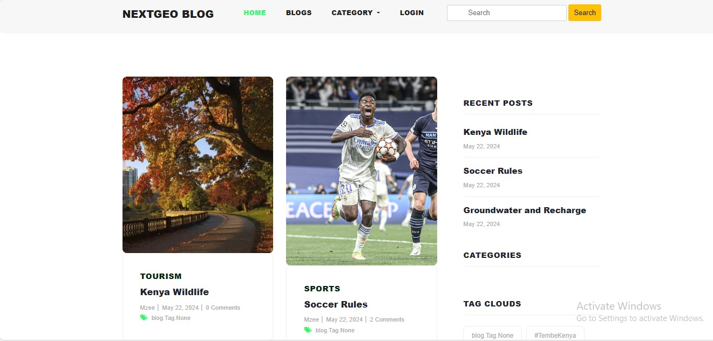
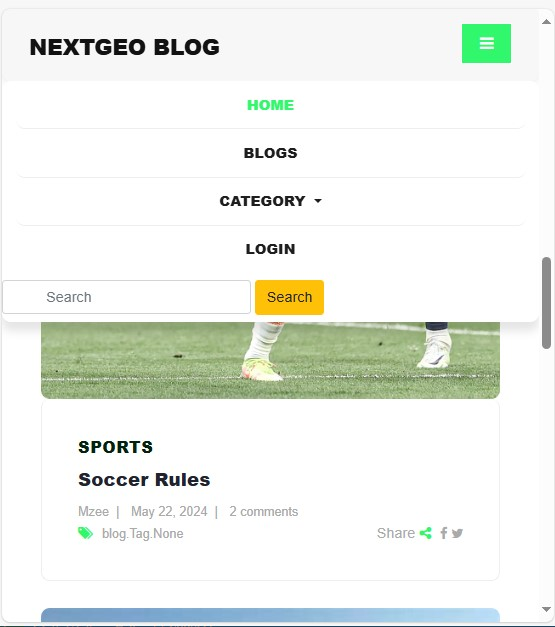
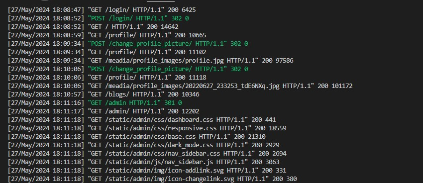
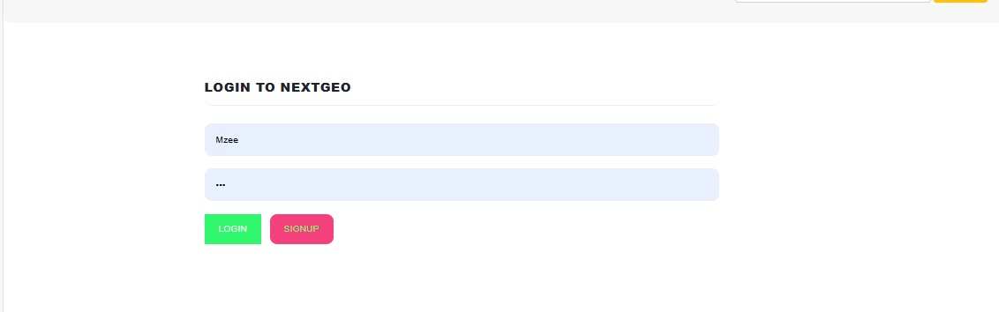
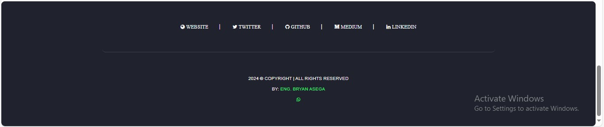

# NextGeo-Blog-website

## Backend Project:<br> Django Framework, Docker Containerization, TypeScript, Tailwind-CSS, Bootstrap, MySQL Database, and Jenkins for CI/CD.
<br>



# About NextGeo Blog Website
  NextGeo is a comprehensive blog website built using the Django framework. This platform allows users to create, read, update, and delete ```(CRUD)``` blog posts, making it a versatile tool for content management. The project is structured to ensure scalability and ease of maintenance, with distinct applications for core features like user profiles, notifications, and blog management with a secure database storage.

 The NextGeo application serves as the core of the project, containing essential configurations and settings. The blog application handles all blog-related functionalities, including creating new posts, editing existing ones, and deleting posts. Sign up and Sign in has been performed and the passwords are securely ```SALTED```. 

 To enhance the user experience, static assets implemented include TypeScript, Tailwind-CSS, Bootstrap, Bootswatch, and FontAwesome and images are organized under the assets directory, with configurations managed by tools like Tailwind CSS.

 This BlogWebsite has been hosted online with a connection to a ```CI/CD pipeline: Jenkins```, where there is a continous integration and continous deployment of the site from time to time without stopping users from their daily routine on the site.

 By leveraging ```Docker```, the deployment process is streamlined, ensuring the application can be consistently run across different environments. This makes NextGeo a robust and flexible solution for anyone looking to manage and share content effectively.
<br> 



# Steps to Run this Project

1. ```git clone https://github.com/Asega-bryan07/NextGeo-Blog-website.git && cd NextGeo-Blog-website```
<br>

## Create Virtual Environment using pipenv
2. ``` pip install pipenv ```

3. ```pipenv install```

4. ``` pipenv shell ```
allow shell to startup
## Install Django
5. ```pipenv install django```

6. ```cd NextGeo```

## Create the Superuser
7. ``` python manage.py createsuperuser ```
enter the prompted details to become a superuser

8. ```python manage.py runserver```
<br>

## Install Docker
Follow the instructions on the official Docker website to install Docker on your system.

8. From the previous installation, we will now be using docker to perform migrations and running the server
```docker-compose up --build```
Note: Ensure the docker file in the root of this directory is available

Modify the website (if need be) to add your own implementation


# Website Structure
Your website should have the structure below in order to avoid migration bugs etc.
```
NextGeo-Blog-website/
├── Dockerfile
├── Pipfile
├── Pipfile.lock
├── README.md
├── docker-compose.yml
├── requirements.txt
└── NextGeo/
    ├── NextGeo/
    │   ├── __init__.py
    │   ├── __pycache__/
    │   ├── asgi.py
    │   ├── settings.py
    │   ├── urls.py
    │   └── wsgi.py
    ├── assets/
    │   ├── css/
    │   ├── custom/
    │   ├── fonts/
    │   ├── images/
    │   ├── js/
    │   └── vendor/
    ├── blog/
    │   ├── __init__.py
    │   ├── __pycache__/
    │   ├── admin.py
    │   ├── apps.py
    │   ├── context_processors.py
    │   ├── forms.py
    │   ├── migrations/
    │   ├── models.py
    │   ├── signals.py
    │   ├── slugs.py
    │   ├── tests.py
    │   ├── urls.py
    │   └── views.py
    ├── main/
    ├── media/
    │   ├── blog_banners/
    │   └── profile_images/
    ├── manage.py
    ├── notification/
    │   ├── __init__.py
    │   ├── __pycache__/
    │   ├── admin.py
    │   ├── apps.py
    │   ├── migrations/
    │   ├── models.py
    │   ├── tests.py
    │   ├── views.py
    ├── package-lock.json
    ├── package.json
    ├── tailwind.config.js
    ├── templates/
    │   └── html/
    └── user_profile/
        ├── __init__.py
        ├── __pycache__/
        ├── admin.py
        ├── apps.py
        ├── backends.py
        ├── context_processors.py
        ├── decorators.py
        ├── forms.py
        ├── managers.py
        ├── migrations/
        ├── models.py
        ├── tests.py
        ├── urls.py
        └── views.py

```
<br>



# FRONTEND PAGES
The frontend page description is as follows:
```
    add_blog.html      -- Form for adding a new blog post.
    banner.html        -- Reusable banner section for different pages.
    base.html          -- Base template that includes common elements including bootstrap, script, and css file paths.
    blog_card.html     -- Template for displaying a preview of individual blog posts.
    blog_details.html  -- Page showing the details of a single blog post.
    blogs.html         -- Page listing all blog posts.
    category_blogs.html-- Page showing blogs filtered by category.
    footer.html        -- Reusable footer section for different pages with details about the developer and profiles.
    header.html        -- Reusable header section for different pages.
    home.html          -- Homepage of the website.
    login.html         -- Login form for user authentication.
    message.html       -- Template for displaying messages or alerts such as followers, and sign up.
    my_blogs.html      -- Page showing blogs authored by the logged-in user.
    notifications.html -- Page showing user notifications.
    pagination.html    -- Template for pagination controls.
    post-details.html  -- Displays details for a logged-in author on the previous blogs they posted.
    profile.html       -- Logged-in User profile page.
    registration.html  -- Registration form for new users.
    scripts.html       -- Template to include common Script files and inline typescript.
    search.html        -- Search results for a blog on a page.
    sidebar.html       -- Reusable sidebar section for different pages.
    tag_blogs.html     -- Page showing blogs filtered by a specific tag.
    update_blog.html   -- Form for updating an existing blog post by a logged in user.
    user_information.html -- Page displaying detailed information about a user and they can edit their details and blogs.

```


# THE BACKEND


# Database

This website is managed by a MySQL database. In order to run it the same way to see your tables and database structure,
ensure you have MySQL Workbench, XAMPP, or WAMP installed in your system, otherwise this will not work. 
However, You can modify this to work using mysqlite database that is installed by default during the creation of this django project. To ensure/know which database is in use, check settings.py file in NextGeo and ensure the following is as expected: <br>
```
DATABASES = {
    default: {
        # ENGINE: django.db.backends.sqlite3, -- default django database 
        # NAME: BASE_DIR / db.sqlite3, --- default database name
        ENGINE: django.db.backends.mysql, 
        NAME: blog_db,
        HOST: localhost,
        PORT: 3306,
        USER: Asega-bryan07,
        PASSWORD: 123,
    }
}
```
Note: This will work if your MySQL server has the Password, Host, and Username as shown above, else, modify it to appear
almost similar to the above but with your own credentials.
<br>


